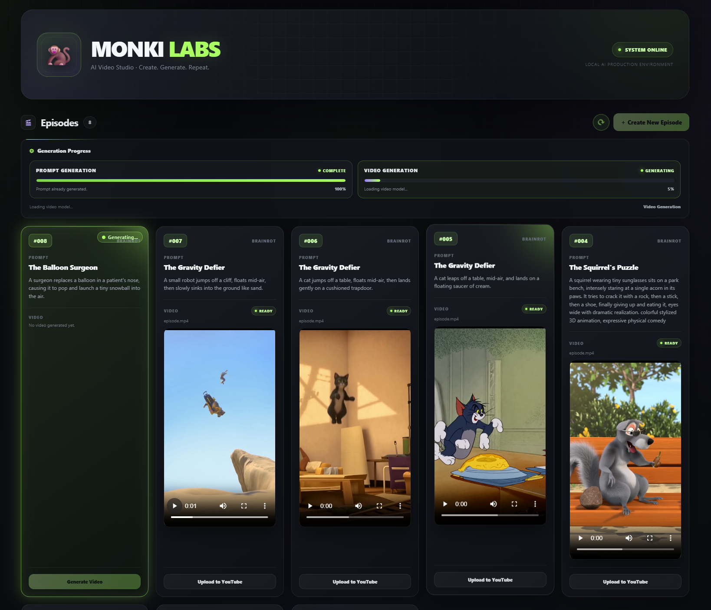
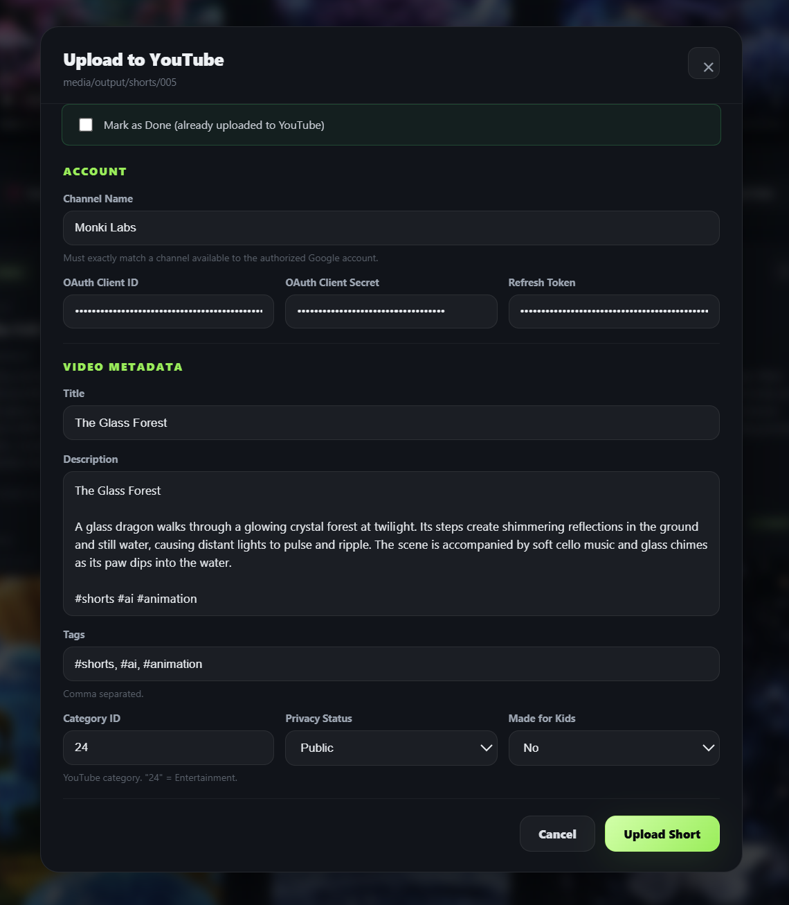
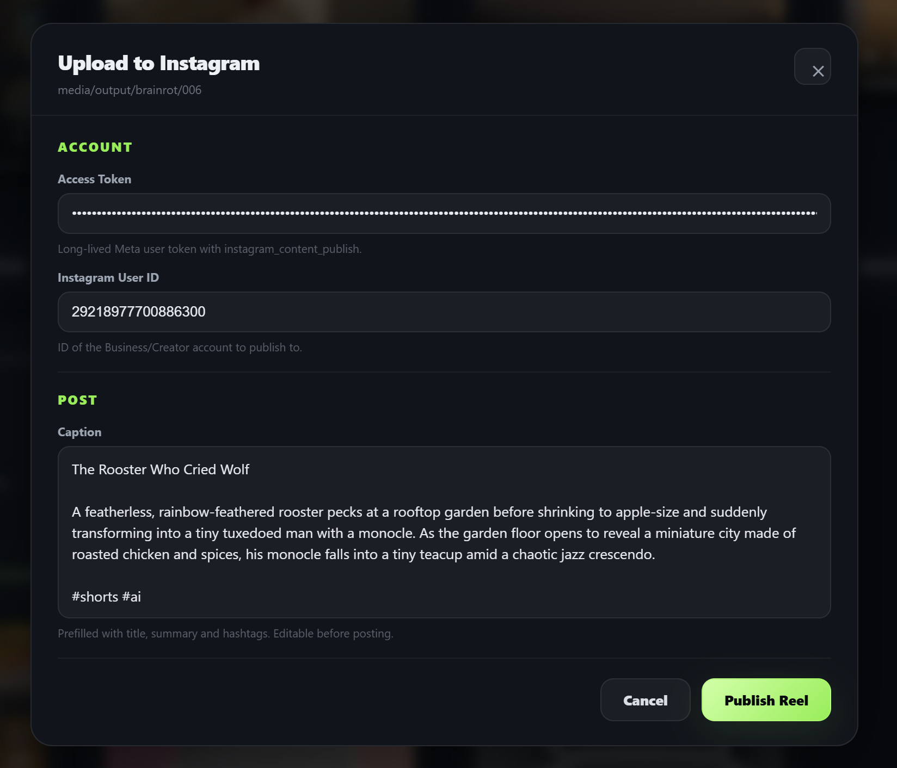

# 🐒 Monki Labs

Monki Labs is an AI video generation studio for creating short-form vertical videos with minimal human interaction.

The project supports local and cloud GPU execution, with a web UI for generation, episode management, replay automation, and direct publishing to YouTube and Instagram.

---

## 🎯 Goals

Monki Labs aims to:

* 🤖 Automatically generate video concepts using a local language model

* 🎬 Generate short-form AI videos from those concepts

* 🎵 Generate video, background music, and sound effects together

* 📱 Produce vertical 9:16 videos optimized for short-form platforms

* 📦 Organize generated episodes automatically under media/output/

* ☁️ Support GPU-based cloud execution

* 🔄 Eventually run automatically without requiring a local PC

* 📅 Support recurring automated video generation and publishing

* 💰 Remain completely free to operate using local/open-source models and free infrastructure where possible

The long-term vision is a pipeline that can run independently, generate quality content, and eventually publish videos automatically.

---

## 🧠 Current Pipeline

At a high level:

```text
Content Configuration

        ↓

Local LLM (Ollama)

        ↓

Structured Video Prompt (LTX-2 format)

        ↓

LTX-2.3 Video Generation (video + audio in one pass)

        ↓

Final MP4

        ↓

Organized Output (media/output/<episode>/)

        ↓

Publish: YouTube Shorts / Instagram Reels
```

The application is **configuration-driven**, allowing content and AI settings to be changed without modifying the core pipeline.

The video generation architecture supports both:

* **Single-prompt generation** for one continuous video

* **Multiple-prompt generation** for multiple coherent clips that are combined into one final video

This allows the number of generated clips to be changed through configuration without redesigning the pipeline.

---

## 🛠️ Tech Stack

### AI

* 🧠 Ollama

* 🤖 Qwen 3 8B

* 🎥 LTX-2.3

* 🤗 Hugging Face Diffusers

* 🔥 PyTorch

### Video

* 🎬 MoviePy

* FFmpeg

* ImageIO

### Application

* 🐍 Python 3.12

* JSON configuration

* Virtual environments

### Development

* VS Code

* Git / GitHub

* Pytest

* Black

* Flake8

---

## 📁 Project Structure

```text
monki-labs/

│

├── ai/

│   ├── __init__.py

│   ├── base_ai_service.py

│   ├── memory_utils.py

│   ├── prompt_generator.py

│   ├── video_generator.py

│   └── providers/

│       ├── __init__.py

│       └── ltx_api_provider.py

│       └── ollama_provider.py

│       └── snapgenai_provider.py

│       └── veo_watermark_remover.py

│

├── config/

│   ├── ai_models.json

│   ├── content.json

│   ├── instagram.json

│   ├── youtube.json

│

├── core/

│   ├── __init__.py

│   ├── config_loader.py

│   ├── hardware_detector.py

│   └── pipeline.py

│

├── web/

│   ├── index.html

│   ├── job_worker.py

│   ├── screenshots/

│   └── server.py

│

├── instagram/

│   ├── __init__.py

│   ├── auth.py

│   ├── config.py

│   ├── publisher.py

│   └── refresh_token.py

│

├── youtube/

│   ├── __init__.py

│   ├── auth.py

│   ├── config.py

│   ├── metadata_generator.py

│   ├── refresh_token.py

│   ├── channel.py

│   └── uploader.py

│

├── media/

│   └── output/

│

├── .gitignore

├── install_linux.sh

├── install_windows.bat

├── main.py

├── README.md

├── requirements.txt

├── run_linux.sh

├── run_windows.bat

└── .venv/ (created locally after install)
```

The active runtime interface is split between the CLI pipeline and the web UI. The web server and job worker live in `web/server.py` and `web/job_worker.py`, while the AI generation logic remains in the `ai/` and `core/` packages.

---

# 💻 Local Setup

Monki Labs is developed locally on Windows using Python 3.12, but the same repo also supports Linux/GPU execution.

## 1. Clone the repository

```powershell
git clone https://github.com/YOUR_USERNAME/monki-labs.git

cd monki-labs
```

If the repository is private, authenticate with GitHub when prompted.

---

## 2. Install dependencies

Run the Windows installer:

```powershell
.\install_windows.bat
```

The installer:

* Checks for Python

* Creates the `.venv` virtual environment

* Detects whether an NVIDIA GPU is available

* Installs the appropriate PyTorch build

* Installs project dependencies

* Checks for FFmpeg

* Verifies PyTorch and CUDA availability

---

## 3. Run Monki Labs

Run the pipeline from the CLI:

```powershell
.\.venv\Scripts\activate

python main.py
```

Run the browser-based UI locally (quick start):

* On Windows (recommended for local development):

```powershell
.\run_windows.bat
```

* On Linux / RunPod (example):

```bash
bash run_linux.sh
```

Both of those scripts start the same web UI and backend pipeline. Alternatively you can start the HTTP server directly:

```powershell
python web/server.py
```

Then open the UI in a browser:

```text
http://localhost:8000
```

UI: Quick guide

* Start the UI using one of the commands above. The server listens on port 8000 by default.

* The UI lets you:

  * Browse generated episodes (media/output/)

  * Start a new generation job (full episode or single prompt)

  * Monitor per-stage progress (prompt generation and video generation)

  * See job status and any error messages returned by the pipeline



---

## 4. Development Workflow

The normal development workflow is:

```text
Edit code

   ↓

.\run_windows.bat

   ↓

Review generated video

   ↓

Make changes

   ↓

.\run_windows.bat
```

Generated videos are stored under:

```text
media/output/
```

Output runs are automatically numbered sequentially.

For example:

```text
media/

└── output/

    ├── 001/

    │   ├── episode.mp4

    │   └── prompt.txt

    ├── 002/

    │   ├── episode.mp4

    │   └── prompt.txt

    └── 003/

        ├── episode.mp4

        └── prompt.txt
```

Each run retains only the **final video** and the **prompt used to generate it**.

Intermediate generated clips are not retained.

---

# ☁️ RunPod / Linux Setup

Monki Labs can run on Linux-based GPU environments such as RunPod without changing the application code.

The same repository and `main.py` are used locally and on cloud GPU environments.

## 1. Clone the repository

```bash
git clone https://github.com/YOUR_USERNAME/monki-labs.git

cd monki-labs
```

For a private repository, authenticate with GitHub and clone the repository.

---

## 2. Install dependencies

Run the Linux installer:

```bash
bash install_linux.sh
```

The installer:

* Creates the Python virtual environment

* Checks for FFmpeg

* Checks for the available GPU environment

* Installs project dependencies

* Verifies PyTorch and CUDA availability

---

## 3. Run Monki Labs

```bash
bash run_linux.sh
```

The Linux runner:

* Starts Ollama with GPU acceleration (fast prompt generation)

* Configures PyTorch CUDA memory handling (`expandable_segments:True`)

* Runs the main pipeline

No application code changes are required to run the pipeline on Linux.

---

## 4. Access the Web UI from Your Browser

When running Monki Labs on a RunPod instance, the web UI runs inside the pod on port `8000`.

RunPod must expose port `8000` as an **HTTP port** so the UI can be accessed from a normal browser outside the pod.

### RunPod port configuration

In the RunPod pod configuration, find:

```text
Expose HTTP ports
```

Add:

```text
8000
```

The exact available ports and services depend on the RunPod pod configuration and template.

For Monki Labs, the important requirement is:

```text
HTTP:
    8000 → Monki Labs
```

If Jupyter is also available through the pod, it may use port `8888`. However, some RunPod configurations or templates may only allow one exposed HTTP service at a time. **Jupyter is not required to run Monki Labs.**

The RunPod Web Terminal can be used instead for command-line access to the pod.

### RunPod Web Terminal

RunPod may provide a browser-accessible Web Terminal on a port such as:

```text
19123
```

This terminal can be used to:

* Run Linux commands

* Activate the Python virtual environment

* Start and stop Monki Labs

* Inspect files and logs

* Manage the running application

The Web Terminal is separate from the Monki Labs HTTP service.

A typical setup can therefore be:

```text
HTTP
└── 8000 → Monki Labs

TCP
└── 22 → SSH

RunPod Web Terminal
└── 19123 → Terminal
```

The exact Web Terminal port is provided by RunPod and may vary.

### Start the Monki Labs server

The web server listens on port `8000` by default.

For example:

```bash
python web/server.py
```

or use the normal RunPod/Linux runner:

```bash
bash run_linux.sh
```

The server must listen on port `8000` so that RunPod can forward browser requests to the application.

### Open the UI

After port `8000` has been exposed, RunPod provides an HTTP proxy URL similar to:

```text
https://<pod-id>-8000.proxy.runpod.net
```

Open that URL in your normal browser.

The exact URL is generated by RunPod and will vary by pod.

### Important

`localhost:8000` refers to the RunPod machine itself. It is **not** the URL to use from your local computer.

When accessing Monki Labs from your own browser, use the RunPod HTTP proxy URL for port `8000`.

For example:

```text
https://<pod-id>-8000.proxy.runpod.net
```

This allows the Monki Labs web UI to be accessed remotely while the application and LTX-2.3 generation process run on the RunPod GPU.

---

## 5. Temporary GPU Environments

RunPod instances can be treated as temporary compute environments.

The repository contains the application and configuration, while generated videos can be retrieved before terminating the instance.

The long-term goal is to use temporary GPU infrastructure only when video generation is required rather than maintaining a continuously running server.

---

# 🖥️ Hardware Requirements

LTX-2.3 is a large model (~50GB in bfloat16). It requires substantial GPU and system memory.

## Minimum (production)

| Component      | Requirement                         |
| -------------- | ----------------------------------- |
| **GPU VRAM**   | 48GB (RTX A6000, RTX L40S)          |
| **System RAM** | 100GB+                              |
| **Storage**    | 200GB+ NVMe (model cache + outputs) |
| **CPU**        | 8+ cores                            |

## Recommended (production)

| Component      | Recommendation        |
| -------------- | --------------------- |
| **GPU**        | RTX L40S (48GB VRAM)  |
| **System RAM** | 100GB+                |
| **Cost**       | ~$1.00/hour on RunPod |

## Why 48GB VRAM is required

The LTX-2.3 pipeline includes a Gemma 3 text encoder (~16GB) plus a video transformer, VAE, and audio components. The full model is ~50GB in bfloat16 — it cannot fit entirely on a 24GB GPU. The pipeline uses **model-level CPU offload** (`enable_model_cpu_offload`) to keep only the active component on GPU at a time, which requires 48GB VRAM.

## Local development

No consumer laptop GPU (8-16GB VRAM) can run this model. For local development, use a **dry-run / test mode** that validates pipeline logic on CPU without loading the full model. Production generation should use cloud GPU instances.

---

# 🏭 Production Configuration

The following configuration has been tested and verified to run end-to-end on an RTX L40S (48GB VRAM, 100GB+ RAM):

## `config/ai_models.json` (video model)

```json
{
    "device_allocation": {
        "mode": "model",
        "vae_tiling": false,
        "vae_slicing": true,
        "attention_slicing": false
    },
    "generation_resolution": {
        "width": 768,
        "height": 1344
    },
    "steps": { "cpu": 8, "cuda": 25 },
    "stg_scale": 1.5,
    "audio_stg_scale": 0.0,
    "guidance_scale": 3.5,
    "audio_guidance_scale": 5.0,
    "stg_blocks": { "indices": [28] }
}
```

## `config/content.json` (content)

```json
{
    "video": {
        "duration_seconds": 6,
        "aspect_ratio": "9:16",
        "fps": 30,
        "resolution": { "width": 1080, "height": 1920 }
    },
    "generation": {
        "clip_count": 1
    }
}
```

## Key settings explained

* **`mode: "model"`** — model-level CPU offload. Keeps only the active component on GPU. Required for 48GB VRAM.

* **`generation_resolution: 768×1344`** — the generation resolution. Output is upscaled to 1080×1920. Higher resolutions (e.g., 896×1600) are possible but increase VRAM usage.

* **`clip_count: 2` × `duration_seconds: 6`** — two 6-second clips concatenated into a 12-second episode. This multi-clip architecture is required because the transformer must hold all frames' latents in VRAM simultaneously — a single 12s clip (289 frames) exceeds 48GB.

* **`stg_scale: 1.5`** — Spatio-Temporal Guidance applied to block 28. Improves sharpness and motion coherence.

* **`audio_stg_scale: 0.0`** — audio STG disabled to reduce VRAM. Audio (music + SFX) is still generated.

* **`low_cpu_mem_usage: true`** — loads the model directly in bfloat16, avoiding the fp32 double-buffer peak during load.

* **`generation_retry_attempts: 2`** — automatic retries when clip generation fails. Any exception is retried; memory-related failures (CUDA OOM / `MemoryError`) additionally trigger an aggressive VRAM/RAM cleanup and a full model reload before retrying.

* **`generation_retry_backoff_seconds: 20`** — base wait between retries. The wait scales with the attempt number (20s, then 40s, ...).

* **Automatic memory release** — after every generation (success or failure) the video model is dropped from memory and CUDA caches are emptied (`ai/memory_utils.py`), so each episode starts with maximum free RAM/VRAM. Memory is also released before model load, after model load, and between clips.

## Expected performance (L40S)

| Metric                          | Value                   |
| ------------------------------- | ----------------------- |
| Per clip (25 steps, 145 frames) | ~9-10 min               |
| Full episode (2 clips + encode) | ~20-25 min              |
| Cost @ ~$1.00/hr                | ~$0.35-0.45 per episode |

---

# ⚙️ Configuration

Monki Labs is **configuration-driven**.

Core behavior is controlled through JSON configuration files rather than hard-coded application logic.

This allows the pipeline to evolve without repeatedly modifying Python code.

Configuration covers areas such as:

* Channel-level content direction (tone, environments, subjects)

* Video duration and output requirements

* Video generation resolution

* Video generation FPS

* Inference steps

* Guidance settings

* AI model selection

* Audio generation behavior

* YouTube configuration (`config/youtube.json`)

* Instagram configuration (`config/instagram.json`)

* Publishing credentials (`.env`, never committed)

The application reads the appropriate configuration at runtime.

---

# 🎥 Video Generation

Monki Labs currently uses **LTX-2.3** for AI video generation, with three
switchable backends:

| `provider` value | Backend | Notes |
| --- | --- | --- |
| `"local"` (default) | Local LTX-2.3 diffusers pipeline | Runs on your own GPU; unchanged behavior |
| `"ltx"` | LTX-2.3 Fast API | Submits the same prompt to the hosted API, polls until finished, downloads the result (legacy value `"api"` still accepted) |
| `"snapgenai"` | SnapGenAI browser automation | Drives https://snapgen.ai/ in Chrome, downloads the video, then removes the Veo watermark with VeoWatermarkRemover |

The switch lives in `config/ai_models.json` →
`models.video_model.provider`. The provider choice happens entirely at the
video-generation layer — prompt generation, episode folders, job progress,
and the final `episode.mp4` output contract are identical for all three.

## API backend workflow

When `provider` is `"ltx"` (or the legacy `"api"`):

1. The exact same generated video prompt is submitted to the API.
2. The submission returns a generation/job ID.
3. The application polls the status endpoint until the job completes,
   fails, or times out. The web server is never blocked — this runs inside
   the existing background job worker, and progress messages stream to the
   UI through the standard progress callback.
4. The finished video (with generated audio) is downloaded and saved as the
   episode's `_clip_001.mp4`, then finalized into `episode.mp4` exactly as
   in local mode.

Failures (submission errors, failed jobs, timeouts, network problems,
malformed responses) surface cleanly through the normal job error state;
the web server stays alive.

## API configuration

```json
"video_model": {
    "provider": "api",
    "api": {
        "base_url": "https://api.ltx.io",
        "submit_path": "/v2/text-to-video",
        "status_path": "/v2/text-to-video/{job_id}",
        "model": "ltx-2-3-fast",
        "send_duration_and_resolution": true,
        "extra_params": {},
        "auth_header": "Authorization",
        "auth_scheme": "Bearer",
        "api_key_env": "LTX_API_KEY",
        "status_field": "status",
        "poll_interval_seconds": 5,
        "timeout_seconds": 900,
        "request_timeout_seconds": 30
    },
    ...
}
```

* `base_url`, `submit_path`, `status_path` — endpoint layout of the
  LTX async API. `{job_id}` in `status_path` is replaced with the
  returned ID.
* `model` — `"ltx-2-3-fast"` or `"ltx-2-3-pro"`.
* `send_duration_and_resolution` — sends `duration` and
  `resolution` (`"widthxheight"`) from `content.json` so API output
  matches local output settings.
* `auth_header` / `auth_scheme` / `api_key_env` — how the API key is sent.
  The key itself is read from `.env` (`LTX_API_KEY=...`) and never stored
  in configuration.
* `extra_params` — optional request-body additions merged into every
  submission.
* `status_field`, `completed_statuses`, `failed_statuses`,
  `result_url_fields`, `job_id_fields` — response-shape overrides for
  providers that use different field names.
* `poll_interval_seconds` / `timeout_seconds` — polling cadence and the
  overall give-up time (LTX recommends 5-second polling).
* `request_timeout_seconds` — per-HTTP-request timeout.

These defaults follow the official LTX async (V2) contract:
`POST /v2/text-to-video` returns `202` with a job `id`;
`GET /v2/text-to-video/{id}` reports `pending | processing | completed |
failed`; a completed job contains `result.video_url`; failures carry
`error.message`. Transient network errors and HTTP 5xx are retried within
the polling window; auth/validation errors and failed jobs are not
retried. Adjust any value if your account uses a different contract; no
code changes are needed.

Monki Labs currently uses **LTX-2.3** for AI video generation.

## SnapGenAI provider (browser automation + watermark removal)

When `provider` is `"snapgenai"`, generation runs through the SnapGenAI
website (https://snapgen.ai/) using **Selenium** Chrome automation, and the
downloaded video is automatically passed through the open-source
**[VeoWatermarkRemover](https://github.com/TrungCang165/VeoWatermarkRemover)**
CLI before it becomes the episode video:

```text
Generate Video → SnapGenAI (browser) → download video
              → VeoWatermarkRemover (standard CPU mode)
              → episode.mp4
```

No local video model is loaded in this mode; everything else (prompt
generation, episode folders, job progress, upload buttons) works exactly as
before.

### Credentials

SnapGenAI credentials live only in `.env` (never committed, never logged,
never included in error messages):

```env
snapgenai_email=...
snapgenai_password=...
```

Missing credentials fail immediately with a clear, non-retried error.

### Browser configuration

All SnapGenAI settings live in `config/ai_models.json` →
`models.video_model.snapgenai`:

```json
"snapgenai": {
    "base_url": "https://snapgen.ai/",
    "headless": false,
    "attach_to_existing_chrome": true,
    "debugging_address": "127.0.0.1:9222",
    "pause_min_seconds": 5,
    "pause_max_seconds": 10,
    "refresh_interval_seconds": 60,
    "aspect_ratio_target": "9:16",
    "aspect_ratio_button_selector": "",
    "aspect_ratio_timeout_seconds": 15,
    "profile_directory": "media/browser_profile/snapgenai",
    "download_directory": "media/downloads/snapgenai",
    "page_timeout_seconds": 60,
    "submit_timeout_seconds": 30,
    "login_popup_wait_seconds": 15,
    "login_form_probe_seconds": 5,
    "login_timeout_seconds": 120,
    "generation_timeout_seconds": 1800,
    "download_timeout_seconds": 300,
    "poll_interval_seconds": 3,
    "download_poll_interval_seconds": 2,
    "watermark_remover": {
        "executable": "tools/GeminiWatermarkTool-Video.exe",
        "output_flag": "",
        "extra_args": [],
        "timeout_seconds": 3600
    }
}
```

* **`headless`** — runs Chrome without a window. Defaults to `false` so the
  browser stays visible while the automation is being developed and tested;
  set to `true` for unattended operation.
* **`attach_to_existing_chrome`** — when `true`, Selenium does **not** launch
  its own Chrome. It attaches to an already-running Chrome through its remote
  debugging interface (`debugging_address`, default `127.0.0.1:9222`) and
  reuses that browser, its profile, cookies, and state. Keep this enabled if
  Cloudflare's "Verify you are human" checkbox loops inside Selenium-driven
  Chrome — attach mode makes the challenge behave like a normal browser. Set
  to `false` to restore the original Selenium-launched-Chrome behavior.
  `headless` stays `false` in both modes.
* **How to start Chrome with remote debugging enabled** — fully close all
  Chrome windows, then launch it with a dedicated profile and the debug port:
  ```text
  chrome.exe --remote-debugging-port=9222 --user-data-dir=%TEMP%\snapgenai-chrome
  ```
  (Linux/macOS: `google-chrome --remote-debugging-port=9222 --user-data-dir=/tmp/snapgenai-chrome`.)
  Keep that Chrome window running before and during the run. No Stealth,
  fingerprint spoofing, or CAPTCHA bypass is performed. If attach mode is
  enabled but no debugging session is reachable, the run stops with a clear
  error telling you to start Chrome with remote debugging.
* **`debugging_address`** — host and port of the remote debugging endpoint;
  defaults to `127.0.0.1:9222`.
* **`pause_min_seconds`** / **`pause_max_seconds`** — a random pause of this
  many seconds is inserted between every workflow step (opening the page →
  typing the prompt → submitting → login → waiting → downloading) so the
  automation does not fire actions back-to-back. Defaults to `5`/`10`.
  Includes a deliberate pause after entering the prompt and before clicking
  submit. This is plain pacing only — no page/cookie/challenge tampering.
* **`refresh_interval_seconds`** — how long to let the page sit doing nothing
  after submit before checking/refreshing while waiting for the generation to
  finish (default `60` seconds). During that full quiet minute the page is
  **not touched at all** (no polling, no refreshing), so the request and any
  just-clicked captcha/popup can settle without the every-second reload
  flicker. After that the wait polls for the download button and refreshes at
  most once per interval. **No retry/resubmission** ever happens after the
  prompt is submitted.
* **`aspect_ratio_target`** / **`aspect_ratio_button_selector`** /
  **`aspect_ratio_timeout_seconds`** — after landing on the generation page
  the provider clicks the `"16:9"` button to switch the output to
  `aspect_ratio_target` (default `"9:16"`), then waits before entering the
  prompt. `aspect_ratio_button_selector` overrides the built-in button lookup
  (CSS, or XPath when it starts with `//`); `aspect_ratio_timeout_seconds` is
  how long to wait for the toggle to take effect (default `15`). This is a
  normal UI toggle, not any bypass technique.
* **`profile_directory`** — a persistent Chrome profile, so the authenticated
  session/cookies are reused between runs instead of logging in every time.
  Close any Chrome instance using this profile before a run starts.
* **`download_directory`** — where Chrome saves the generated video before
  watermark removal.
* **Timeouts** — every wait phase (page load, submit, login, generation,
  download) has its own deadline; waits are event/element-state driven with
  short poll intervals, not fixed sleeps.

Monki Labs currently uses **LTX-2.3** for AI video generation.

Optional, per-site selector overrides (CSS, or XPath when the value starts
with `//`) are available if snapgen.ai changes its markup:
`prompt_selector`, `submit_selector`, `download_selector`,
`failure_selector`, `login_email_selector`, `login_password_selector`,
`login_submit_selector`. Sensible built-in fallbacks are used when they are
empty.

### Browser workflow

When **Generate Video** is clicked with `provider: "snapgenai"`:

1. The SnapGenAI tab is brought to the foreground (if the attached Chrome has
   several tabs open), then Chrome loads https://snapgen.ai/ (visible unless
   `headless` is `true`).
2. After a pause, the provider clicks the `"16:9"` aspect-ratio button so the
   output switches to `"9:16"`, then pauses again.
3. The episode's generated prompt is entered into the prompt field.
4. **Generate/Submit** is clicked.
5. If a login tab/popup (or an inline login form) appears, the provider
   signs in using the `.env` credentials and returns to the generation page.
   Both single-step forms (email + password together) and stepwise flows
   (email → **Continue** → password) are supported; the defaults recognize
   common fields like `input[name="username"]` and buttons labelled
   **Continue** / **Sign in** / **Log in**.
6. **No retry or re-submission** happens after the prompt is submitted, and
   a random pause follows every step (including after a captcha/popup) rather
   than an instant click. The page is then left untouched (no polling or
   refreshing) for a full `refresh_interval_seconds` (default `60` seconds)
   so the submit and any captcha can settle, after which the provider polls
   for the download control / failure indicators and refreshes at most once
   per interval.
7. The download is triggered and the download directory is watched until the
   file is complete and validated.
8. The video is passed through VeoWatermarkRemover and the cleaned result is
   finalized as `episode.mp4`.

### VeoWatermarkRemover setup

1. Download the latest `GeminiWatermarkTool-Video` binary from the
   [VeoWatermarkRemover releases](https://github.com/TrungCang165/VeoWatermarkRemover/releases)
   page (Windows / Linux / macOS builds are available).
2. Place it in `tools/` (e.g. `tools/GeminiWatermarkTool-Video.exe`) or point
   `watermark_remover.executable` at its location.
3. On first run your OS may prompt about the unsigned binary — allow it once
   (Windows: *More info → Run anyway* or `Unblock-File`).

**Standard CPU mode only.** The wrapper always runs the default
reverse-alpha-blending removal in CPU mode — the ML (`--ml`) mode is never
used and is explicitly rejected if added to `extra_args`. `output_flag` can
be set (e.g. `"-o"`) for builds that require a flag before the output path;
by default the output path is passed as the second positional argument, with
an automatic fallback that detects the tool's output file next to the input
if the build does not accept one.

The removal preserves the original video untouched apart from the
watermarked region — resolution, FPS, duration, and audio are all kept. The
cleaned video is copied to `episode.mp4` **without re-encoding**, so nothing
is upscaled or otherwise enhanced. The original download is only deleted
after the cleaned output has been created and validated, and generation is
only marked successful once a valid `episode.mp4` exists.

### Error handling

Failures surface cleanly through the normal job error state and the retry
settings (`generation_retry_attempts` / `generation_retry_backoff_seconds`):

* Missing credentials — non-retried, actionable message (no values shown).
* Login failure — non-retried; check the configured credentials.
* Generation failure / failure indicators on the page — retried.
* Download failure or timeout — retried.
* Watermark-removal failure (missing executable, non-zero exit, timeout,
  unsupported input, missing/corrupt output) — missing executable and
  unsupported inputs are non-retried; transient removal failures retry.
* Invalid/corrupt videos are rejected by validation before anything is
  marked successful.
* Filesystem errors (moving, copying, replacing files) produce explicit
  errors naming the file involved.

SnapGenAI generates one video per episode, so set
`config/content.json` → `generation.clip_count` to `1` when using this
provider; otherwise finalization fails with an explanatory error.

The video model generates the visual content and associated audio in the same generation process.

Content configuration controls the final video requirements, including:

* Duration

* Aspect ratio

* Output FPS

* Resolution

* Video format

AI model configuration separately controls generation-specific settings such as:

* Generation resolution

* Generation FPS

* Inference steps

* Guidance scale

* Audio guidance

* Spatio-temporal guidance

* Negative prompts

This keeps output requirements and model-specific generation settings configurable without hard-coding them into the application.

---

# 📝 Prompt Generation

Video concepts are generated in a **single pass** by a local Ollama language
model (Qwen 3 8B).

## Visual-first entertainment philosophy

The channel produces **visually compelling short-form entertainment**.
The only hard goal:

> Create something visually compelling enough to make someone stop scrolling
> and keep watching.

Every concept is built around this priority order:

1. Immediate visual hook
2. Strong environment/background
3. Visually interesting subject
4. Clear physical action
5. Novelty and curiosity
6. Escalation/progression
7. Satisfying or surprising payoff
8. Simple, understandable premise

Comedy, absurdity, surrealism, cuteness, spectacle, mystery, creepiness, and
satisfying visuals are all valid directions. The **environment is treated as
critical** — every setting must actively add depth, atmosphere, scale, color,
or spectacle rather than exist behind the subject. Concepts avoid dialogue,
on-screen text, complex narratives, large crowds, and multi-step
interactions so LTX can render them as one continuous sequence.

## LTX-2.3 prompt structure

The generator produces prompts that follow the official LTX-2.3 prompting
guide so they plug directly into video generation:

* A single flowing paragraph starting with `Style: <style>, <shot scale>…`
* Scene setting: lighting source, color palette, textures, atmosphere
* One living protagonist defined by physical traits; emotion expressed
  through physical cues, never abstract labels
* Chronological action flow with connectors (`as`, `then`, `while`)
* At most one deliberate camera move, described relative to the subject
* Background music and sound effects derived from the concept and woven into
  the paragraph chronologically (never hardcoded)

## Dynamic length

Prompt word count is derived from `content.json` →
`video.duration_seconds` (currently 12–20 words per second), so changing the
episode duration automatically rescales prompt size.

## Diversity rotation

A shuffled-playlist rotation of visual styles keeps consecutive episodes
varied. It is a plain list in `config/content.json` (`style_rotation`)

* **`style_rotation`** — visual styles (cinematic-realistic, claymation,
  retro anime, Pixar-style 3D, film noir, …). The generated paragraph must
  open with the selected style.

No style repeats until the whole list has been used, and never back-to-back
across cycle boundaries. Settings are chosen freely by the model from the
environment guidance (the `world` list and the visual-first instructions),
with soft anti-repetition via the variety rules and recent-concept memory.

## Guidance (not filtering)

Living protagonists ("the main character must be ALIVE"), uncanny-not-gory
mutations, unexpected behavior, and stop-scrolling visual hooks are injected as guidance into
every request. The parser only performs structural cleanup (JSON repair,
title derivation) — a truly unparseable response raises a loud error rather
than silently producing nothing.

## Episode files

Each episode writes:

```text
media/output/<episode>/prompt.txt

TITLE: The Escalator Race
PROMPT: Style: retro anime, low-angle shot… (full paragraph incl. music/SFX)
SUMMARY: A pigeon in a conductor hat races a stalled escalator.
```

`SUMMARY` is a 1–3 sentence plain-language description written by the same
LLM call, used to prefill YouTube/Instagram descriptions without exposing
camera jargon.

# 📺 YouTube Uploads

Completed episodes can be uploaded directly from the web UI. Each episode card with a finished `episode.mp4` includes an **Upload to YouTube** button that opens a metadata and authentication modal.




### Upload metadata

The modal allows the following video fields to be reviewed and changed before upload:

* **Channel Name** — human-readable channel name. The server resolves this through the authenticated Google account using `channels.list(mine=true)` and refuses missing, unmatched, or ambiguous names.

* **Title** — prefilled from the `TITLE:` value in the episode's `prompt.txt`.

* **Description** — prefilled from the episode `TITLE:` and short `SUMMARY:` (not the long generation prompt), followed by default hashtags from `config/youtube.json`.

* **Tags** — comma-separated YouTube tags.

* **Category ID** — YouTube's numeric category identifier. The default is `24` (Entertainment).

* **Privacy Status** — `private`, `unlisted`, or `public`.

* **Made for Kids** — controls the corresponding YouTube audience declaration.

### OAuth credentials

The account section contains only the values needed for OAuth authentication:

* OAuth Client ID
* OAuth Client Secret
* Refresh Token

Credentials are loaded from `.env` using these keys:

```env
youtube_client_id=YOUR_CLIENT_ID
youtube_client_secret=YOUR_CLIENT_SECRET
youtube_refresh_token=YOUR_REFRESH_TOKEN
```

Uppercase variants (`YOUTUBE_CLIENT_ID`, `YOUTUBE_CLIENT_SECRET`, and `YOUTUBE_REFRESH_TOKEN`) are also supported. Environment values override the corresponding values in `config/youtube.json`, allowing that JSON file to contain only non-secret defaults such as `channel_name`.

The token helper reads the client ID and client secret from `config/youtube.json` (or `.env`) automatically, opens Google's consent screen, and writes the resulting refresh token back to `.env`:

```powershell
python -m youtube.refresh_token
```

The OAuth flow requires both `youtube.upload` and `youtube.readonly` scopes. The readonly scope is used to resolve and verify the human-readable Channel Name before uploading. If an existing refresh token was created without that scope, run the helper again and approve the additional permission.

### Upload process

The backend exchanges the refresh token for a temporary access token, verifies the requested channel, and uploads the MP4 through the YouTube Data API v3 resumable upload protocol. Access tokens expire after approximately one hour; they are regenerated automatically and do not need to be stored manually.

For Google accounts managing multiple Brand channels, authorize the intended channel/account context and test the first upload with `private` visibility. YouTube's standard `videos.insert` endpoint does not provide a normal target-channel parameter, so the application rejects channel-name mismatches instead of guessing.

# 📸 Instagram Uploads

Completed episodes can also be published as Instagram **Reels** directly from the web UI. Each episode card with a finished `episode.mp4` includes an **Upload to Instagram** button next to the YouTube button.



## Modal fields

The form keeps only what is required:

**Account** (prefilled from `.env`, editable per publish):

* **Access Token** — long-lived Instagram API token (~60 days)
* **Instagram User ID** — numeric ID of the Instagram professional account

**Post:**

* **Caption** — prefilled as `TITLE` + `SUMMARY` + default hashtags from `config/instagram.json`, fully editable

## Public URL requirement

Instagram's servers fetch the video themselves, so publishing requires a **publicly reachable HTTPS URL** for the episode MP4. The application derives it automatically from however you are browsing the UI:

* Locally: run `run_windows.bat` with cloudflared installed — the script auto-starts a quick tunnel and prints the public URL. Browse the app through that URL.
* On RunPod: expose port 8000 as an HTTP port and browse through the provided `https://<pod-id>-8000.proxy.runpod.net` URL.

If the derived host is `localhost`, the server logs a warning and publish failures include the exact unreachable URL for diagnosis.

## Credentials and token refresh

Credentials live only in `.env` (never in JSON config):

```env
instagram_access_token=...
instagram_user_id=...
```

Optional, only needed when `config/instagram.json` points at `graph.facebook.com` instead of the default `graph.instagram.com`:

```env
instagram_app_id=...
instagram_app_secret=...
```

Refresh the ~60-day token before it expires — no arguments needed:

```powershell
python -m instagram.refresh_token
```

The helper exchanges the current still-valid token via the appropriate grant (`ig_refresh_token` on `graph.instagram.com`, `fb_exchange_token` on `graph.facebook.com`) and writes the new token back to `.env` automatically.

## Publish process

The backend validates the account, builds the public video URL, then follows Instagram's container flow: create a media container pointing at the video URL → poll until Meta finishes processing → publish the container → resolve the post permalink. Processing can take a few minutes; keep both the server and tunnel/proxy alive until it completes.

## Upload tracking

Every episode folder can contain an `upload.txt` file recording which
platforms the episode has been published to:

```text
youtube=true
instagram=false
```

The web UI keeps this file in sync automatically:

* A successful YouTube or Instagram upload marks that platform as done.
* Each upload modal includes a **"Mark as Done"** toggle for manually
  marking (or unmarking) a platform.
* Uploaded platforms show a green checkmark on the episode card buttons.

# 💰 Cost Philosophy

Monki Labs follows a **free-only philosophy**.

The project prioritizes:

* 🆓 Local and open-source AI models

* 🆓 Free software

* 🆓 Free development tools

* ☁️ Temporary GPU infrastructure when needed

* 🔑 No paid AI APIs

* 🔑 No required paid API keys

* 🔑 No required subscriptions

The goal is to keep the software and AI pipeline free to operate, using temporary GPU infrastructure only when necessary for generation.

---

# 🔄 Completed Workflow

Monki Labs currently supports the following workflow:

```text
Idea

  ↓

Structured AI Prompt (style + setting rotation)

  ↓

AI Video + Integrated Audio (LTX-2.3)

  ↓

Final Video (media/output/<episode>/)

  ↓

Publish: YouTube Shorts / Instagram Reels

  ↓

Optional Replay Toggle (continuous auto-generation)
```

The developer configures the content and generation settings, starts an episode from the web UI, and can optionally enable replay to continue generating episodes automatically. Finished episodes can be published to YouTube Shorts and Instagram Reels directly from each episode card.

---

## 📜 License

Copyright © 2026 Aden Tran. All rights reserved.

This repository is publicly available for viewing and reference purposes only. No permission is granted to use, copy, modify, distribute, sublicense, or commercially exploit this code without explicit written permission from the copyright holder.
